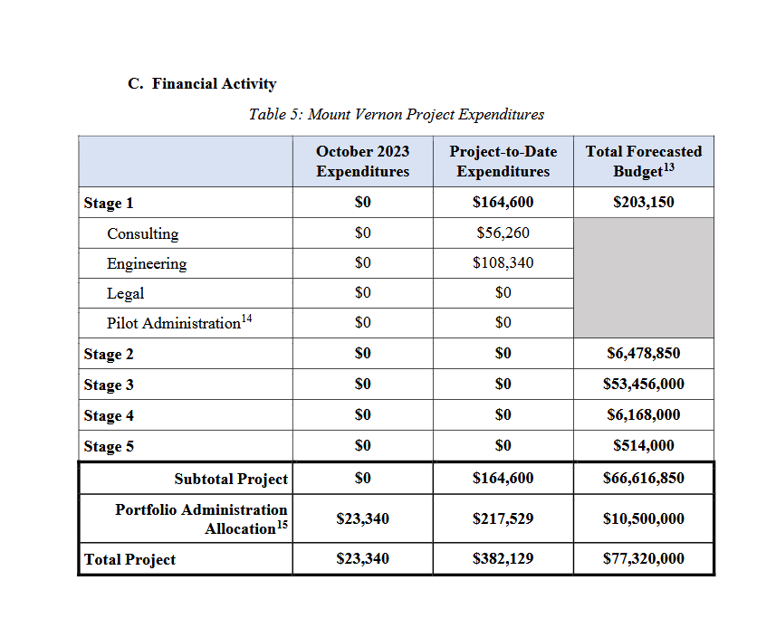
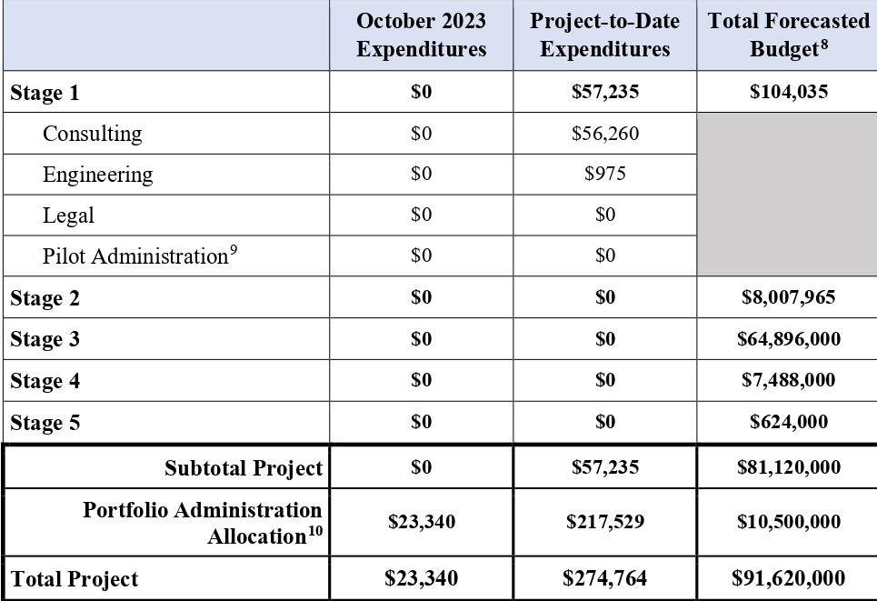

# Table Transformer (TATR)
**Table Transformer (TATR)** is a 2023 deep learning model designed to detect and extract tables from PDF files. It supports a variety of output files for these tables - most notably CSV. If properly configured, it will likely prove a superior alternative to **Nougat** for detecting and extracting table data from files that contain tables, for use as RAG data. It requires some experimentation with the settings and models - most notably the **crop padding**, which is discussed below.

TATR uses a two-step process for extracting tables. The first step, **table detection**, detects any tables present on a page of the PDF file, determines its boundaries, and crops this part of the page as an image file. An optional padding setting is present so that a small amount of space around the table will also become a part of this image. It requires a list of words and coordinates, as well as a series of scanned images from the PDF.

The second step, **structure recognition**, takes these cropped tables as input, and calculates the positions of all rows and columns. It then takes this data combined with text locations to extract the data as a CSV file.

## Installation

TATR must be [cloned from GitHub at **microsoft/table-transformer**](https://github.com/microsoft/table-transformer/). Pre-trained models are [available for download on **Hugging Face**](https://huggingface.co/bsmock). Download links are also included in a table in the repository's [**README.md**](https://github.com/microsoft/table-transformer/blob/main/README.md) file. So far, of the four available pre-trained structure recognition model cards, only the [**TATR-v1.0**](https://huggingface.co/bsmock/tatr-pubtables1m-v1.0) model card has been tested on the documents for this project.

## Usage

The details of the two scripts used are documented in at https://github.com/microsoft/table-transformer/blob/main/docs/INFERENCE.md. Note that the PDF must be converted to image files beforehand to use as input. Each page of the PDF must also have a corresponding JSON file containing text blocks grouped by coordinates, which is to be linked in the commands. The Python code below can be used to generate these files:

    import pymupdf
    import json
    doc = pymupdf.open("path/to/file.pdf")
    page_no = 0
    for page in doc:
            page_no += 1
            word_list = page.get_text("blocks")
            page_list = []
            for i in word_list:
                    page_list.append({"bbox": list(i[0:4]), "text": i[4]})
            page_json = json.dump(page_list, open("file_page-000" + str(page_no) + "_words.json", "w"))

The PDF file must also be converted into a series of image files. This can be done through a variety of tools. Note that the text file's name must be based on the corresponding image file's name: **\<name\>.jpg** must have **\<name\>_words.json** to go with it.

It is recommended to run table detection and table structure recognition as two separate steps, in order to make debugging, troubleshooting, and rerunning individual steps easier and quicker. Details on how this can be done through either CLI or Python can be found in the GitHub documentation.

## Issues

While TATR is very useful, certain issues have been found that have prevented it from being implemented thus far. These issues are likely not insurmountable, but require finding the right settings or perhaps training better models.

The most notable issue is the tendency for TATR to leave out a single row or column at the edge. This is likely solvable through adjusting the crop padding setting.

An example is shown below:

**Initial PDF page:**

**Cropped table image:**

**Extracted table data (.csv):**

    ,October 2023 Expenditures,Project-to-Date Expenditures,Total Forecasted Budget8
    Stage 1,$0,"$57,235","$104,035"
    Consulting,$0,"$56,260",
    Engineering,$0,$975,
    Legal,$0,$0,
    Pilot Administration9,$0,$0,
    Stage 2,$0,$0,"$8,007,965"
    Stage 3,$0,$0,"$64,896,000"
    Stage 4,$0,$0,"$7,488,000"
    Stage 5,$0,$0,"$624,000"
    Subtotal Project,$0,"$57,235","$81,120,000"
    Portfolio Administration Allocation10,"$23,340","$217,529","$10,500,000"

Another notable issue is that, as shown above, footnotes become regular text, resulting in random numbers. This is likely not an issue in the case of words, but for numerical data, care must be taken (likely by counting the gaps between commas in numbers) to ensure that the numbered footnotes do not end up altering data.
